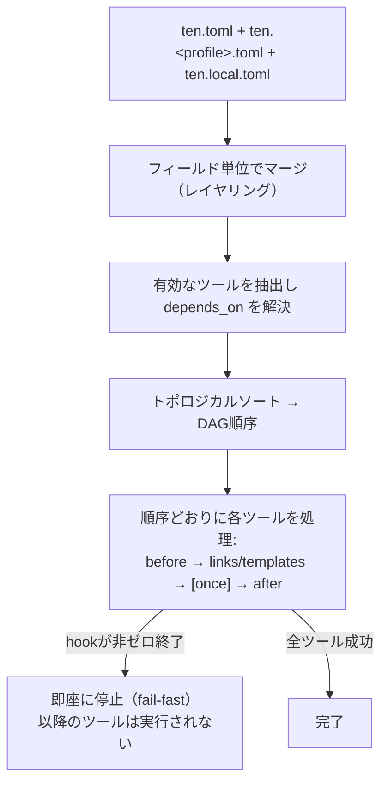
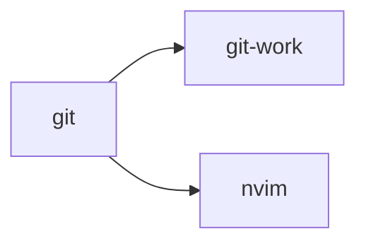
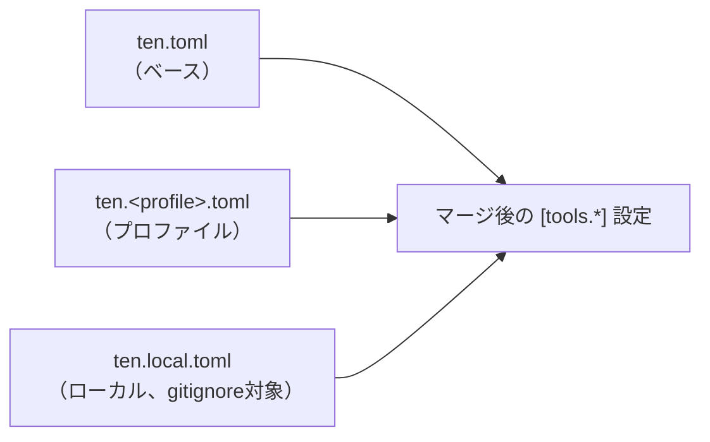
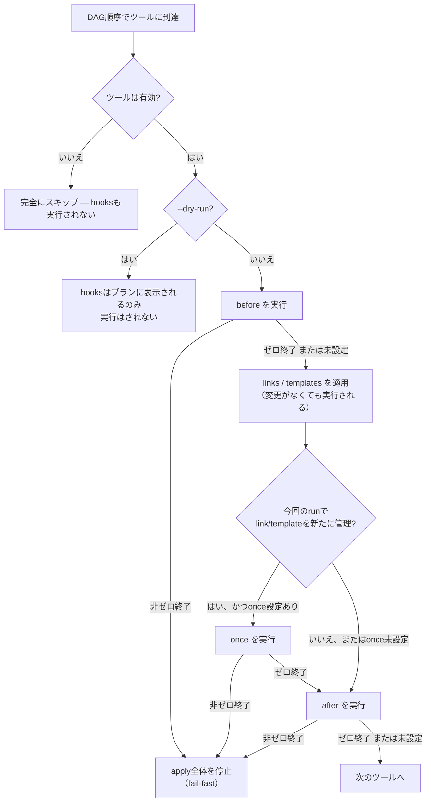

# ten (点)

[](https://github.com/rinsyan0518/ten/actions/workflows/ci.yml)

> **⚠️ `ten` はまだ開発段階です。予告なく破壊的変更が入ることがあります。**

[English](README.md) | 日本語

`ten` はGo製のdotfilesマネージャCLIです。シンプルな仕組みで宣言的にdotfilesを管理でき、特定の使い方に縛られないため、必要になったら他のツールへいつでも移行できます。

- **冪等性** — 何度実行しても同じ結果に収束する
- **安全なバックアップ** — 上書きする前に既存ファイルをバックアップする
- **依存関係解決** — ツールは `depends_on` によるDAG順序で適用される
- **マシンごとの差分** — プロファイル別ファイル＋ローカルオーバーライド
- **ステートフルなガベージコレクション** — 設定から削除されたリソースは自動的にクリーンアップされる
- **ディレクトリ構造を強制しない** — `links`/`templates` の参照元パスはリポジトリ内の単なるパスであり、`ten` は特定のディレクトリ構成を要求しない
- **Destroy** — `ten destroy` は管理しているものすべてを取り壊し、バックアップを復元する

## 目次

- [インストール](#インストール)
- [クイックスタート](#クイックスタート)
- [applyの仕組み](#applyの仕組み)
- [設定リファレンス](#設定リファレンス)
- [コマンド](#コマンド)
- [開発](#開発)
- [ライセンス](#ライセンス)

## インストール

ビルド済みバイナリはLinuxとmacOS（amd64/arm64）向けに配布されています。Windowsには対応していません。

とりあえず試したいだけなら、インストールスクリプトを実行してください。最新リリースをダウンロードし、チェックサムを検証したうえで `$HOME/.local/bin`（`INSTALL_DIR` で変更可能）にインストールします。バージョンを固定したい場合は `TEN_VERSION` を指定してください:

```bash
curl -fsSL https://raw.githubusercontent.com/rinsyan0518/ten/main/install.sh | sh
```

またはGo経由で:

```bash
go install github.com/rinsyan0518/ten/cmd/ten@latest
```

またはクローンしてビルド:

```bash
git clone https://github.com/rinsyan0518/ten.git
cd ten
go build -o ten ./cmd/ten
```

## クイックスタート

`ten` は3種類の設定/状態ファイルを扱います:

| ファイル | 配置場所 | dotfilesリポジトリで管理する? | 役割 |
|---|---|---|---|
| `ten.toml` / `ten.<profile>.toml` | `<dotfiles_root>/` | する | 望ましい状態 — どのツールをどこに配置するか |
| `ten.local.toml` | `<dotfiles_root>/ten.local.toml` | しない（`.gitignore` に追加） | マシンローカルな設定: 秘密の変数やツールのローカルオーバーライド |
| `ten.state.json` | `$XDG_STATE_HOME/ten/ten.state.json`（フォールバック先: `~/.local/state/ten/ten.state.json`） | 対象外（リポジトリの外に存在） | ブートストラップ用のポインタ（`ten init` が設定する `dotfiles_root`/`profile`）と、`ten` が現在管理しているものの自動生成された記録 |

### 1. tenにdotfilesリポジトリを指定する

```bash
cd ~/dotfiles
ten init                                    # dotfiles_root はデフォルトでカレントディレクトリになる
# または: ten init --path ~/dotfiles --profile work
```

### 2. dotfilesリポジトリに `ten.toml` を追加する

```toml
# ~/dotfiles/ten.toml
[tools.git]
links = { "home:.gitconfig" = "git/.gitconfig" }

[tools.nvim]
links = { "xdg:nvim" = "nvim" }
after = "nvim --headless '+Lazy! sync' +qa"
```

### 3. （任意）マシンローカルなオーバーライドを追加する

`ten.local.toml` は `ten.toml` と同じくdotfilesリポジトリ内に置くため、作成する前に `.gitignore` に追加してください:

```bash
echo ten.local.toml >> ~/dotfiles/.gitignore
```

```toml
# ~/dotfiles/ten.local.toml — gitignore対象、コミットしない
[vars]
git_email = "taro.yamada@work.example.com"
git_name = "Taro Yamada"
```

これらの変数は `templates` から次のように参照されます:

```
# ~/dotfiles/git/gitconfig.local.tmpl
[user]
    email = {{ .Vars.git_email }}
    name = {{ .Vars.git_name }}
```

テンプレートからは `.Ten.*` も参照できます — こちらはユーザーが定義する値ではなく、`ten` が apply 実行時に自分で解決する値です:

| フィールド | 値 |
|---|---|
| `.Ten.OS` | `runtime.GOOS`(例: `darwin`, `linux`) |
| `.Ten.Arch` | `runtime.GOARCH`(例: `arm64`, `amd64`) |
| `.Ten.Hostname` | 実行中マシンのホスト名 |
| `.Ten.Home` | 解決済みの `$HOME` |
| `.Ten.Profile` | 有効なプロファイル(未設定なら空文字列) |
| `.Ten.Tool` | テンプレートが属する `[tools.*]` の名前 |
| `.Ten.DotfilesRoot` | dotfilesリポジトリの絶対パス |

`.Ten.Home`/`.Ten.DotfilesRoot` はローカルの絶対パス(OSのユーザー名を含みうる)をそのまま埋め込みます。公開するファイルに描画結果を含める場合は注意してください。

```
# ~/dotfiles/ssh/config.tmpl
{{ if eq .Ten.OS "darwin" }}
UseKeychain yes
{{ end }}
Host *
    HostName {{ .Ten.Hostname }}
```

### 4. 適用する

```bash
ten apply --dry-run   # 変更内容をプレビュー
ten apply             # 実際に適用
```

### 5. （任意）取り消す

```bash
ten destroy --dry-run   # 削除内容をプレビュー
ten destroy              # 実際に削除し、バックアップを復元
```

## applyの仕組み

`ten apply` は設定を解決し、依存関係でツールを並べ替えたうえで、その順序で各ツールのhooksとリソースを実行します:



設定だけからは分かりにくい2点:

- **hooksは有効なツールに対して必ず実行される** — `links`/`templates` に実際の変更があったかどうかに関わらず、リソースを持たずhooksだけを定義しているツールでも実行される。
- **hookが失敗すると実行全体が停止する。** `before`・`once`・`after` のいずれかが非ゼロ終了すると、`ten apply` は即座に停止する — DAG順序で後にあるツールは一切実行されない。
- **`once` はツールごとに最大1回だけ発火する。** 今回のrunでそのツールが `links`/`templates` の対象を新たに管理する場合(＝`ten.state.json` に未登録だった場合)にのみ実行される。`links`/`templates` を持たないツールでは発火しない。

依存関係の順序、設定のレイヤリング、hook実行については以降のセクションで詳しく説明します。

## 設定リファレンス

### ターゲットパスのプレフィックス

`links` / `templates` のキーは、次のいずれかのプレフィックスを使って絶対パスに解決されます:

- `home:` → `$HOME` 配下
- `xdg:` → `$XDG_CONFIG_HOME` 配下（フォールバック先: `$HOME/.config`）

### `[tools.*]`

```toml
[tools.git-work]
enabled    = false                                                   # 省略時のデフォルトは true
depends_on = ["git"]                                                 # 依存先のあとに、DAG順序で適用される
links     = { "home:.gitconfig" = "git/.gitconfig" }                 # シンボリックリンク
templates = { "home:.gitconfig.local" = "git/gitconfig.local.tmpl" } # text/template で描画される（{{ .Vars.key }} / {{ .Ten.key }}）
before = "echo before"                                                # このツールのリソースより前に実行するシェルコマンド
once   = "echo once"                                                  # このツールが link/template を新たに管理した最初の1回だけ実行するシェルコマンド
after  = "echo after"                                                 # あとに実行するシェルコマンド
```

#### 依存関係の順序

`depends_on` はトポロジカルソートでツールを並べます: あるツールは、それが依存するものすべてのあとに必ず適用されます。例えば `git-work` が `git` に依存している場合、適用順序は次のようになります:



`git` が最初に適用され、`git-work` と `nvim` はそのあとに適用されます（両者の相対的な順序は未規定です）。あるツールの `depends_on` が無効化されたツールを指している場合、`ten apply` は黙ってスキップせずエラーになります — 依存先を有効にするか、`depends_on` から取り除いてください。

#### 設定のレイヤリング

`[tools.*]` の定義は `ten.toml` → `ten.<profile>.toml` → `ten.local.toml` の順にレイヤリングされます:



- **フィールド単位のマージ**: 後段のレイヤーは実際に設定したフィールドのみを上書きし、未設定のフィールドは前段のレイヤーの値のまま残ります。
- **`links` / `templates` / `depends_on` は丸ごと置換**: 後段のレイヤーがこれらのフィールドを少しでも設定すると、そのフィールド全体が置き換わります（1つのフィールド内でのキー単位のマージは行われません）。
- **`before` / `once` / `after` は空文字列を「未設定」として扱う**: そのため後段のレイヤーは、前段のレイヤーで設定された値を明示的にクリアすることはできません。
- **旧 `enabled_tools` は無視される**: このフィールドが存在する前の設定に残っている、トップレベルの `enabled_tools` キーはエラーにならず黙って無視されるため、すべてのツールはデフォルトの `enabled = true` にフォールバックします。古い設定を移行する場合は、`enabled_tools` を削除し、各ツールのオン/オフ状態をそれぞれの `[tools.*]` ブロックの `enabled` フィールドに移してください。

#### hookの実行



`before` と `after` は、有効な各ツールに対してDAG順序で無条件に実行されます — そのツールのリソースに変更がなくても、`links`/`templates` を持たずhooksだけを定義しているツールでも実行されます。`once` は、今回のrunでそのツールが `links`/`templates` の対象を新たに管理する場合(＝run開始時点で `ten.state.json` に未登録だった場合)にのみ実行されます — シンボリックリンク/テンプレート操作自体がno-opだったかどうかとは独立しており、`links`/`templates` を持たないツールでは発火しません。`--dry-run` では、hooksはプランに表示されるだけで実行されません(`once` の発火判定自体はstateだけを見るため、この判定ロジックはdry-runでも変わりません)。`before`・`once`・`after` のいずれかが非ゼロ終了すると `ten apply` は即座に停止します。DAG順序で後にあるツールは実行されません。

`enabled` を使うと、他のフィールドを繰り返し書かずにレイヤーごとにツールのオン/オフを切り替えられます。例えば `ten.toml` でデフォルト無効なツールを定義し、特定のプロファイルだけで有効にする場合:

```toml
# ten.toml（共通、常に読み込まれる）
[tools.git]
links = { "home:.gitconfig" = "git/.gitconfig" }

[tools.git-work]
enabled    = false
depends_on = ["git"]
templates  = { "home:.gitconfig.local" = "git/gitconfig.local.tmpl" }

# ten.work.toml（profile = "work" のときだけ読み込まれる）
[tools.git-work]
enabled = true
```

`vars` も同じ base → profile → local のレイヤリングに従いますが、ツール単位ではなく変数キー単位でマージされます: 後段のレイヤーで宣言された変数はそのキーだけを上書きし、前段のレイヤーだけで宣言された変数はそのまま残ります。

## コマンド

```
ten init [--path <path>] [--profile <name>]   dotfilesリポジトリをtenに指定する（--path省略時はカレントディレクトリ）
ten apply [--dry-run]                         現在のプロファイルで解決されたすべてのツールをDAG順序で適用する
ten destroy [--dry-run]                       ten.state.jsonのみを使って（設定不要で）tenが管理しているものをすべて削除し、存在する場合はバックアップを復元する
```

`ten apply` も `ten destroy` も個別ツールを指定した実行はサポートしていません — 何が適用/削除されるかは、各ツールの `enabled` フィールドによって宣言的に制御されます。

`ten destroy` はhooksを一切実行しません — `depends_on` はapply時のhook実行順序を決めるためだけのものであり、destroyはそれを完全に無視します。また `ten.state.json` を削除することもありません: 管理しているすべてのリソースを削除・復元したあと、管理リソースが空の状態でファイルを書き直します（`ten init` が設定したブートストラップ用フィールド（`dotfiles_root`/`profile`）は保持されます）。

`ten init` の `--profile` は省略時、既存のプロファイルをそのまま変更しません。クリアしたい場合は `--profile ""` を明示的に指定してください。

## 開発

一部のテスト（`cmd/ten`）はビルド済みの `ten` バイナリを実際のファイルシステムに書き込みながらエンドツーエンドで動かし、hookコマンドも実行するため、ローカル環境を汚さないようDockerサンドボックス内でのみ実行されます。実行にはDockerが必要です。

```bash
make build      # go build -o bin/ten ./cmd/ten
make test       # go test -p 1 ./...
make lint       # golangci-lint run
make fmt        # golangci-lint fmt (rewrites files)
make fmt-check  # golangci-lint fmt --diff (fails if formatting is needed)
make vulncheck  # govulncheck ./...
make ci         # build + fmt-check + lint + vulncheck + test
```

## ライセンス

[MIT](LICENSE)
