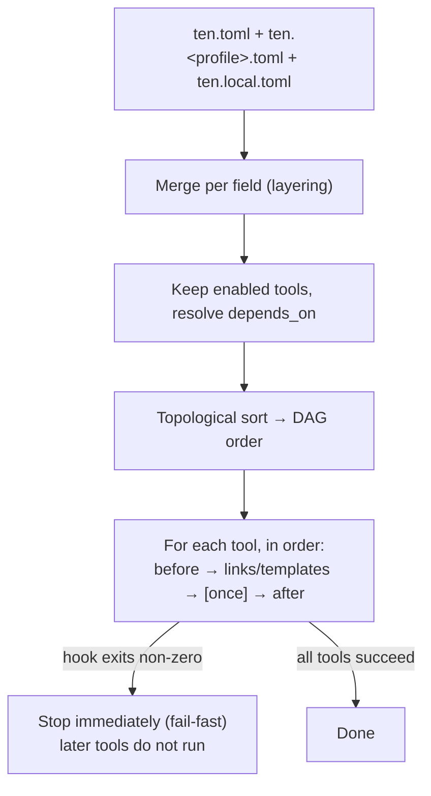
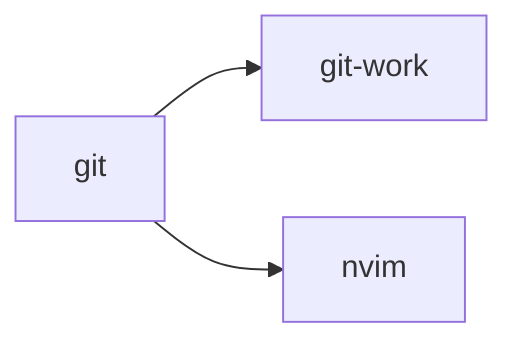
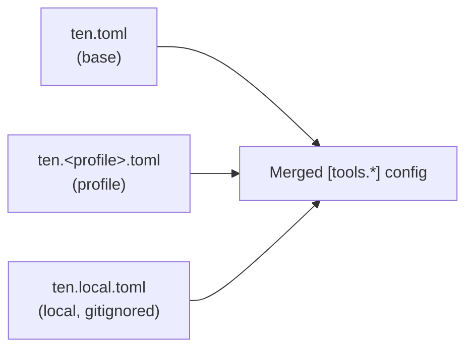
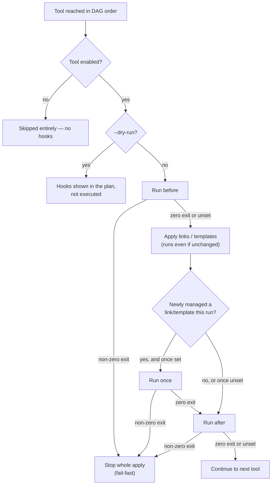

# ten (点)

[](https://github.com/rinsyan0518/ten/actions/workflows/ci.yml)

> **⚠️ `ten` is under development. Breaking changes may land without notice.**

English | [日本語](README.ja.md)

`ten` is a Go CLI dotfiles manager. Its simple, declarative design doesn't lock you into a particular way of working, so you can move to another tool anytime you need to.

- **Idempotent** — running it repeatedly always converges to the same result
- **Safe backups** — existing files are backed up before anything is overwritten
- **Dependency resolution** — tools apply in DAG order via `depends_on`
- **Per-machine differences** — profile-specific files plus local overrides
- **Stateful garbage collection** — resources removed from config are automatically cleaned up
- **No imposed layout** — `links`/`templates` source paths are just paths in your repo; `ten` doesn't require any particular directory convention
- **Destroy** — `ten destroy` tears down everything it manages and restores backups

## Contents

- [Install](#install)
- [Quick start](#quick-start)
- [How apply works](#how-apply-works)
- [Configuration reference](#configuration-reference)
- [Commands](#commands)
- [Development](#development)
- [License](#license)

## Install

Prebuilt binaries are published for Linux and macOS (amd64/arm64); Windows is not supported.

Just want to try it out? Run the install script, which downloads the latest release, verifies its checksum, and installs it to `$HOME/.local/bin` (override with `INSTALL_DIR`; pin a version with `TEN_VERSION`):

```bash
curl -fsSL https://raw.githubusercontent.com/rinsyan0518/ten/main/install.sh | sh
```

Or via Go:

```bash
go install github.com/rinsyan0518/ten/cmd/ten@latest
```

Or clone and build:

```bash
git clone https://github.com/rinsyan0518/ten.git
cd ten
go build -o ten ./cmd/ten
```

## Quick start

`ten` works with three kinds of config/state:

| File | Location | Track in your dotfiles repo? | Role |
|---|---|---|---|
| `ten.toml` / `ten.<profile>.toml` | `<dotfiles_root>/` | Yes | Desired state — which tools go where |
| `ten.local.toml` | `<dotfiles_root>/ten.local.toml` | No (add to `.gitignore`) | Machine-local settings: secret vars and local tool overrides |
| `ten.state.json` | `$XDG_STATE_HOME/ten/ten.state.json` (falls back to `~/.local/state/ten/ten.state.json`) | N/A (lives outside the repo) | Bootstrap pointer (`dotfiles_root`/`profile`, set by `ten init`) plus an auto-generated record of what `ten` currently manages |

### 1. Point ten at your dotfiles repo

```bash
cd ~/dotfiles
ten init                                    # dotfiles_root defaults to the current directory
# or: ten init --path ~/dotfiles --profile work
```

### 2. Add `ten.toml` to your dotfiles repo

```toml
# ~/dotfiles/ten.toml
[tools.git]
links = { "home:.gitconfig" = "git/.gitconfig" }

[tools.nvim]
links = { "xdg:nvim" = "nvim" }
after = "nvim --headless '+Lazy! sync' +qa"
```

### 3. (Optional) Add machine-local overrides

`ten.local.toml` lives inside your dotfiles repo alongside `ten.toml`, so add it to `.gitignore` before creating it:

```bash
echo ten.local.toml >> ~/dotfiles/.gitignore
```

```toml
# ~/dotfiles/ten.local.toml — gitignored, not committed
[vars]
git_email = "taro.yamada@work.example.com"
git_name = "Taro Yamada"
```

These vars are consumed by `templates`, e.g.:

```
# ~/dotfiles/git/gitconfig.local.tmpl
[user]
    email = {{ .Vars.git_email }}
    name = {{ .Vars.git_name }}
```

Templates can also reference `.Ten.*` — values `ten` resolves itself at apply time, rather than ones you define:

| Field | Value |
|---|---|
| `.Ten.OS` | `runtime.GOOS` (e.g. `darwin`, `linux`) |
| `.Ten.Arch` | `runtime.GOARCH` (e.g. `arm64`, `amd64`) |
| `.Ten.Hostname` | the current machine's hostname |
| `.Ten.Home` | resolved `$HOME` |
| `.Ten.Profile` | the active profile (empty string if none) |
| `.Ten.Tool` | name of the `[tools.*]` block the template belongs to |
| `.Ten.DotfilesRoot` | absolute path to the dotfiles repository |

`.Ten.Home`/`.Ten.DotfilesRoot`/`.Ten.Hostname` embed a local absolute path or your machine's hostname, which may contain your OS username — avoid rendering them into files you publish.

```
# ~/dotfiles/ssh/config.tmpl
# generated by ten on {{ .Ten.Hostname }}
{{ if eq .Ten.OS "darwin" -}}
Host *
    UseKeychain yes
{{ end -}}
Host bastion
    IdentityFile {{ .Ten.Home }}/.ssh/id_{{ .Ten.Hostname }}
```

### 4. Apply

```bash
ten apply --dry-run   # preview what would change
ten apply             # apply for real
```

### 5. (Optional) Undo

```bash
ten destroy --dry-run   # preview what would be removed
ten destroy              # remove for real, restoring backups
```

## How apply works

`ten apply` resolves your config, orders tools by their dependencies, then runs each tool's hooks and resources in that order:



Two details that aren't obvious from the config alone:

- **Hooks always run for an enabled tool**, regardless of whether its `links`/`templates` actually changed, and even if the tool defines only hooks with no resources at all.
- **A failing hook stops the whole run.** If `before`, `once`, or `after` exits non-zero, `ten apply` stops immediately — tools later in DAG order never run.
- **`once` fires at most once per tool.** It runs only when this apply run causes the tool to newly manage a `links`/`templates` target that wasn't already recorded in `ten.state.json`; it never fires for a tool with no `links`/`templates`.

Later sections cover dependency order, config layering, and hook execution in more detail.

## Configuration reference

### Target path prefixes

Keys in `links` / `templates` resolve to absolute paths using one of these prefixes:

- `home:` → under `$HOME`
- `xdg:` → under `$XDG_CONFIG_HOME` (falls back to `$HOME/.config`)

### `[tools.*]`

```toml
[tools.git-work]
enabled    = false                                                   # defaults to true when omitted
depends_on = ["git"]                                                 # applied after its dependencies, in DAG order
links     = { "home:.gitconfig" = "git/.gitconfig" }                 # symlinks
templates = { "home:.gitconfig.local" = "git/gitconfig.local.tmpl" } # rendered via text/template ({{ .Vars.key }} / {{ .Ten.OS }})
before = "echo before"                                                # shell command run before this tool's resources
once   = "echo once"                                                  # shell command run only the first time this tool newly manages a link/template
after  = "echo after"                                                 # shell command run after
```

#### Dependency order

`depends_on` orders tools with a topological sort: a tool always applies after everything it depends on. For example, `git-work` depending on `git` gives this apply order:



`git` applies first; `git-work` and `nvim` apply after it (their relative order to each other is unspecified). If a tool's `depends_on` names a tool that ends up disabled, `ten apply` errors instead of silently skipping it — enable the dependency or remove it from `depends_on`.

#### Config layering

`[tools.*]` definitions are layered `ten.toml` → `ten.<profile>.toml` → `ten.local.toml`:



- **Per-field merge**: a later layer overrides only the fields it actually sets, leaving fields it leaves unset untouched from the earlier layer.
- **`links` / `templates` / `depends_on` replace as a whole**: when a later layer sets one of these fields at all, it replaces the entire field (no per-key merging within a single field).
- **`before` / `once` / `after` treat an empty string as "not set"**: a later layer can't explicitly clear a value set by an earlier layer.
- **Legacy `enabled_tools` is ignored**: a leftover top-level `enabled_tools` key from before this field existed is silently ignored (not an error), so every tool falls back to its default of `enabled = true`. If you're migrating an old config, delete `enabled_tools` and move each tool's on/off state into its own `[tools.*]` block's `enabled` field.

#### Hook execution



`before` and `after` run unconditionally for every enabled tool, in DAG order — even when the tool's resources didn't change, and even for a tool with hooks but no `links`/`templates`. `once` runs only when this apply run causes the tool to newly manage at least one `links`/`templates` target — one that wasn't already recorded in `ten.state.json` when the run started; it is independent of whether the underlying symlink/template operation was itself a no-op, and it never fires for a tool with no `links`/`templates`. Under `--dry-run`, hooks are shown in the plan but never executed (the `once` eligibility check itself still runs, since it only reads state, not the filesystem). A non-zero exit from `before`, `once`, or `after` stops `ten apply` immediately; tools later in DAG order do not run.

Use `enabled` to turn a tool on or off per layer without repeating its other fields — e.g. define a tool disabled by default in `ten.toml` and flip it on for one profile:

```toml
# ten.toml (common, always loaded)
[tools.git]
links = { "home:.gitconfig" = "git/.gitconfig" }

[tools.git-work]
enabled    = false
depends_on = ["git"]
templates  = { "home:.gitconfig.local" = "git/gitconfig.local.tmpl" }

# ten.work.toml (loaded only when profile = "work")
[tools.git-work]
enabled = true
```

`vars` follows the same base → profile → local layering but merges per variable key rather than per tool: a variable declared in a later layer overrides only that one key, leaving variables declared solely in earlier layers untouched.

## Commands

```
ten init [--path <path>] [--profile <name>]   Point ten at a dotfiles repository (--path defaults to the current directory)
ten apply [--dry-run]                         Apply every tool resolved by the current profile, in DAG order
ten destroy [--dry-run]                       Remove everything ten manages using ten.state.json only (no config required), restoring backups where they exist
```

Neither `ten apply` nor `ten destroy` supports targeting individual tools — what gets applied or destroyed is controlled declaratively via each tool's `enabled` field.

`ten destroy` never runs hooks — `depends_on` only orders hook execution during `apply`, and destroy ignores it entirely. It also doesn't delete `ten.state.json`: after removing or restoring every managed resource, it rewrites the file with an empty managed-resources record, keeping the bootstrap fields (`dotfiles_root`/`profile`) set by `ten init`.

`ten init`'s `--profile` leaves the existing profile unchanged when omitted; pass `--profile ""` explicitly to clear it.

## Development

Some tests (`cmd/ten`) drive the built `ten` binary end to end, writing to a real filesystem and executing hook commands, so they run exclusively inside a Docker sandbox to avoid touching your local environment. Docker is required to run them.

```bash
make build      # go build -o bin/ten ./cmd/ten
make test       # go test -p 1 ./...
make lint       # golangci-lint run
make fmt        # golangci-lint fmt (rewrites files)
make fmt-check  # golangci-lint fmt --diff (fails if formatting is needed)
make vulncheck  # govulncheck ./...
make ci         # build + fmt-check + lint + vulncheck + test
```

## License

[MIT](LICENSE)
